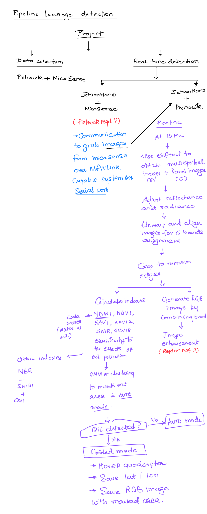

# Oil_pipeline_detection

# Code
[Jupyter notebook](https://github.com/DimpleB0501/Oil_pipeline_detection/blob/main/Alignment.ipynb) displaying parts of the workflow.

### Oil indexes paper
[Novel oil spill indices for sentinel-2 imagery: A case study of natural seepage in Qaruh Island, Kuwait](https://www.sciencedirect.com/science/article/pii/S2215016123005162)

### Codes MICA SENSE Python
[Github-imageprocessing](https://github.com/micasense/imageprocessing)  
[Github-integration_jetson_nano](https://github.com/micasense/rededge-api)

### NOTES
[SWIR](https://www.edmundoptics.in/knowledge-center/application-notes/imaging/what-is-swir/) - displays the images showing the difference between normal RGB and SWIR based images.

